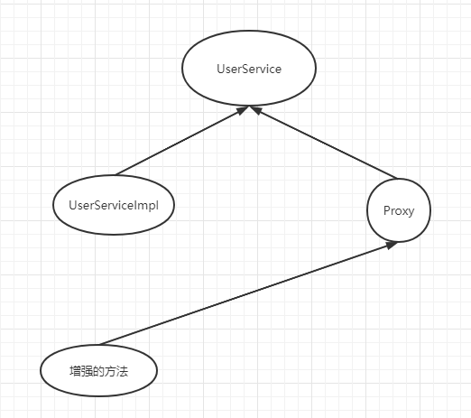

# 遇到的问题

## 1.获取bean找不到

在构建service层时，测试事务是否生效的时候使用以下代码：

```java
  @org.junit.Test
    public void testService(){
        ApplicationContext a = new ClassPathXmlApplicationContext("applicationContext.xml");
        UserService bean = a.getBean(UserServiceImpl.class);
        User user = new User(CreateId.getUUID(),"name",10,"男","111","111");
        bean.addUser(user);
    }
```

被测试代码：

```java
@Service
@Transactional
public class UserServiceImpl implements UserService {

    @Resource
    UserMapper userMapper;

    @Override
    public int addUser(User user) {
        user.setName("true");
        userMapper.addUser(user);
        int i = 10 / 0;
        user.setName("false");
        userMapper.addUser(user);
        return 0;
    }
    
}
```

遇到以下问题：

```java
org.springframework.beans.factory.NoSuchBeanDefinitionException: No qualifying bean of type 'com.fourteen.service.impl.UserServiceImpl' available
```

此时应该为：

```java
@org.junit.Test
    public void testService(){
        ApplicationContext a = new ClassPathXmlApplicationContext("applicationContext.xml");
        UserService bean = a.getBean(UserService.class);
        User user = new User(CreateId.getUUID(),"name",10,"男","111","111");
        bean.addUser(user);
    }
```

获取的对象应该为接口而不是实现类对象

因为@Service虽然会实现对象但是@Transactional也会实现一个代理对象并且替代之前已经生成的对象，所以

```java
        UserService bean = a.getBean(UserServiceImpl.class);
```

才会找不到对象

具体分析：

测试代码（在UserServiceImpl类上没有添加@Transactional）：

```java
    @org.junit.Test
    public void testService(){
        ApplicationContext a = new ClassPathXmlApplicationContext("applicationContext.xml");
        UserService bean = a.getBean(UserService.class);
        Object userService = a.getBean("userServiceImpl");
        
        System.out.println(bean);
        System.out.println(userService);

    }
```

结果：

```java
class com.fourteen.service.impl.UserServiceImpl
class com.fourteen.service.impl.UserServiceImpl
```

UserServiceImpl类上添加@Transactional：

```java
class com.sun.proxy.$Proxy22
class com.sun.proxy.$Proxy22
```

由分析可知有以下关系：UserServiceImpl实现了UserService，但因为开启了事务管理，所以事务管理生成了一个新的代理对象代替了之前UserServiceImpl在spring容器中的位置，而这个时候UserServiceImpl和com.sun.proxy是平级的，所以不能根据UserServiceImpl.class获取而是可以根据其名字userServiceImpl获得对象。




## 2.上传文件

上传文件代码：

```java
public class UploadFile {
    public static String upfile(MultipartFile upload, HttpServletRequest request) throws IOException {

//        上传至本地
        //这里的路径是我偷懒直接这样写 但是正确的方法应该是从参数中获取本地的路径（每个人项目的路径不一样）
        //但是如果部署在服务器就不需要上传到本地 但是我了为方便观看所以这样写
        String path = "D:\\Java\\JavaProject\\PetsApp\\src\\main\\resources\\static\\img";
        //判断该路径是否存在
        File file = new File(path);
        if (!file.exists()) {
            //如果不存在则创建一个目录
            file.mkdirs();
        }
        //获取上传文件的名称
        String filename = upload.getOriginalFilename();
        //把文件名设置成一个唯一值
        String uid = CreateId.getUUID();
        filename = uid + "_" + filename;
        //完成文件上传 , 将文件存放到 path 指定目录下 并 把名字设置为 filename 指定的名字
        upload.transferTo(new File(path, filename));

//        上传至服务器
        // 定义上传文件服务器路径 这里的路径和下面在tomcat中配置的路径是有映射的，必须一致
        String path2 = "http://localhost:8080/img/";
        // 创建客户端的对象
        Client client = Client.create();
        // 和图片服务器进行连接
        WebResource webResource = client.resource(path2 + filename);
        // 上传文件
        webResource.put(upload.getBytes());
		//返回服务器中的路径，之后显示数据就直接用这个路径
        return path2+filename;

    }
}
```

首先需要导入包：

```java
<!-- 文件上传需要 -->
<dependency>
  <groupId>commons-io</groupId>
  <artifactId>commons-io</artifactId>
  <version>2.4</version>
</dependency>
<dependency>
  <groupId>commons-fileupload</groupId>
  <artifactId>commons-fileupload</artifactId>
  <version>1.4</version>
</dependency>
    
<dependency>
  <groupId>javax.servlet</groupId>
  <artifactId>javax.servlet-api</artifactId>
  <version>4.0.1</version>
</dependency>
    
<!-- 获取服务器端需要 -->
<dependency>
  <groupId>com.sun.jersey</groupId>
  <artifactId>jersey-core</artifactId>
  <version>1.18.1</version>
</dependency>
<dependency>
  <groupId>com.sun.jersey</groupId>
  <artifactId>jersey-client</artifactId>
  <version>1.18.1</version>
</dependency>
    
<!-- 文修改tomcat配置需要 -->
<dependency>
  <groupId>org.apache.tomcat</groupId>
  <artifactId>tomcat-catalina</artifactId>
  <version>10.0.0</version>
</dependency>

```

在tomcat配置文件web.xml文件的DefaultServlet初始化参数中加入:

```java
<init-param>
    <param-name>listings</param-name>
    <param-value>false</param-value>
</init-param>
```

在idea中配置tomcat需要加上(这里是配置服务器中你保存图片的路径):


## 声明：所有分析和理解都是个人意见，如有不同意见请勿喷~

